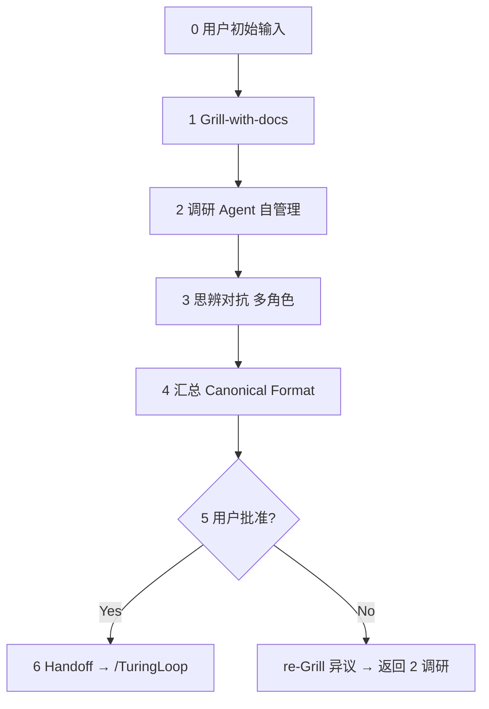

# PlanLoop — Canonical Specification v1.3

**Planning subsystem** for TuringOS Lite: structured, eval-first, anti-drift.  
**Execution subsystem:** approved plan → `/TuringLoop` (AgenticForgeLoop v1.4).

> **认证（Art. 0）**  
> 基于 2026 社区 Best Practice（Matt Pocock grill-with-docs、Grill Me、Anthropic Harness、Karpathy Software 3.0）+ 项目文档风格审查。  
> 所有环节必要且不可精简；格式锁定为 Canonical Proposal Format v1.0。

---

## Activation

```text
Activate PlanLoop v1.3 / PlanLoop
Initial intent: [您的描述]
```

**Orchestrator 收到激活后 MUST：**
1. 读取 `AGENTS.md` + `HARNESS_INDEX.md` + `references/plan-capsule-template.yaml`
2. 实例化 PlanCapsule；**立即进入 Step 1 Grill-with-docs**（禁止跳过）
3. 执行 `references/grill-with-docs.md`（grilling + domain modeling + checklist 出口）
4. 产出物必须符合 `references/canonical-proposal-format.md`（强制模板）
5. 用户批准前 **禁止** 写实现代码或 dispatch `/TuringLoop`

---

## Art. 1 — Best Practice 对齐（摘要）

| PlanLoop 环节 | 社区对齐 |
|---------------|----------|
| **Grill-with-docs（起始）** | Matt Pocock `/grill-with-docs` = `/grilling` + `/domain-modeling` |
| Grill Me 出口标准 | Socratic intent extraction + `CONTEXT.md` + plan ADRs |
| 调研自管理 | Claude Code research delegation、multi-agent allocation |
| 思辨对抗 | Adversarial debate / red-team in agent harnesses |
| Eval + Shipgate | Eval-first、per-level gates |
| 批准 + re-Grill | Self-healing approval loops、rollback to clarification |

---

## Art. 2 — 对抗性审查结论（不可跳过环节）

| 反方观点 | 结论 |
|----------|------|
| "Grill-with-docs 太慢可跳过" | **驳回** — 跳过导致 Drift；DOMAIN 术语未固化则后续全偏 |
| "只要 grilling 不要 CONTEXT/ADR" | **驳回** — 无 glossary 则 Plan/Turing 对象命名漂移 |
| "调研/思辨可合并" | **驳回** — 需广度（调研）+ 深度（对抗）分离 |
| "格式太重" | **驳回** — 固定格式是可验证、可追溯唯一保障 |

---

## Art. 3 — 必要性证明（6 环节）

| # | 环节 | 必要性 |
|---|------|--------|
| 0 | 用户初始输入 | 锚点 |
| 1 | **Grill-with-docs（起始）** | 意图 + 领域语言 + 关键 ADR；第一次输入永远不完整 |
| 2 | **调研**（Agent 自管理） | 事实基础，防凭空设计 |
| 3 | **思辨对抗**（多角色） | 单视角有盲区 |
| 4 | **汇总 → Canonical Format** | 可验证、可追溯、可执行 |
| 5 | **批准 + re-Grill 迭代** | 用户真正拥有最终意图 |

---

## PlanLoop v1.3 流程



### Step 0 — 用户初始输入
- 记录 `initial_intent` 到 PlanCapsule
- 预定 `plans/PL-YYYYMMDD-slug/` 路径（供 Step 1 写 `CONTEXT.md` / `adr/`）
- 不做方案；不写代码

### Step 1 — Grill-with-docs（**起始，mandatory**）

**Spec:** `references/grill-with-docs.md`  
**Also:** `references/grill-me-checklist.md`（机器出口条件）

Orchestrator 行为 = **grilling** + **domain-modeling** 合一：

1. **一次一问** — .walk 设计树；每问附带推荐答案；可多轮
2. **边问边写** — `plans/<plan_id>/CONTEXT.md`（术语表）与 `plans/<plan_id>/adr/*.md`（重大权衡）
3. **代码可答则先探库** — Charter、`architecture/`、现有 atom 先例
4. **TuringOS 术语** — Micro/Macro 尺度、Capsule/Contract/Receipt、Predicate vs evidence

出口：`grill_with_docs.complete: true` + checklist 全满足 → 产出 `problem_statement`、`desired_final_state`、`out_of_scope`、`success_metrics`

若已安装 `.agents/skills/grill-with-docs`，行为等价；PlanLoop 以本 repo `references/grill-with-docs.md` 为准。

### Step 2 — 调研（Agent 自管理）
- Orchestrator 分配调研子任务（WebSearch/WebFetch、repo 读、Charter/architecture）
- 仅摘要 + URL 写入 `research.findings`；禁止整页 dump
- 聚焦：现有代码、Charter 约束、类似 atom 先例；**对齐 Step 1 `CONTEXT.md` 术语**

### Step 3 — 思辨对抗（多角色）
- 执行 `references/adversarial-roles.md`（Advocate / Skeptic / Minimalist / 可选 Verifier）
- 可用 `Task` subagent 并行 Skeptic + Minimalist
- 产出 `consensus_approach` + `residual_risks`

### Step 4 — 汇总 Canonical Format
- **必须**使用 `references/canonical-proposal-format.md` 骨架
- §0 Overall Eval **先于** Module/Phase/Atom
- 引用 Step 1：`plans/<plan_id>/CONTEXT.md` 与相关 ADR
- 每层 **Shipgate**；Atom 层 **Acceptance**（可运行命令）
- 写入 `plans/PL-YYYYMMDD-slug.md`（及同目录 `CONTEXT.md`、`adr/`）

### Step 5 — 用户批准
- 呈现完整提案；**Approval Status: Pending**
- 用户回复：
  - **Yes** → `approval_status: approved`；更新 §0 sign-off
  - **No + 异议** → 记录 `user_objections` → Step 1 re-Grill（仅异议区）→ Step 2

### Step 6 — Handoff（批准后）
```yaml
handoff:
  approved_at: "YYYY-MM-DD"
  turing_loop_ready: true
  proposal_path: "plans/PL-..."
  context_path: "plans/PL-.../CONTEXT.md"
  adrs: ["plans/PL-.../adr/0001-....md"]
  next_action: |
    Activate AgenticForgeLoop v1.4 / TuringLoop
    Task: [from §0]
    ETA estimate: [from plan]
    frontier_mode: auto
```

更新 `HARNESS_INDEX.md` 若新增 plan 类型或路径约定 → `index_updated: true`。

---

## 与 TuringLoop 的关系

| Phase | Skill | 产出 |
|-------|-------|------|
| **Plan** | `/PlanLoop` | CONTEXT + ADRs + Canonical Proposal（Pending → Approved） |
| **Execute** | `/TuringLoop` | Code + tests + SHIP + HANDOFF |

**Rule:** PlanLoop 不写 Macro 代码。TuringLoop 使用 Plan 阶段 `CONTEXT.md` 术语，不重新定义 §0 — 若执行中偏离，回到 PlanLoop re-Grill。

---

## Orchestrator 启动清单

- [ ] PlanCapsule 已实例化；`plans/<plan_id>/` 路径已预定
- [ ] **Step 1 Grill-with-docs 未跳过**
- [ ] `references/grill-with-docs.md` 已加载
- [ ] §0 Overall Eval 将在 Module 之前撰写
- [ ] Canonical Format 模板已加载
- [ ] 用户批准前零实现代码
- [ ] 进入 Step 0 → **立即 Step 1**

---

## 参考文件

| 文件 | 用途 |
|------|------|
| `CHANGELOG.md` | v1.2→v1.3 演进、对抗性测试 — 修改 PlanLoop 前必读 |
| `references/grill-with-docs.md` | **Step 1 起始** — grilling + domain modeling |
| `references/grill-me-checklist.md` | Step 1 机器出口条件 |
| `references/plan-capsule-template.yaml` | PlanCapsule v1.3 |
| `references/canonical-proposal-format.md` | **强制**输出模板 |
| `references/adversarial-roles.md` | Step 3 多角色对抗 |
| `.agents/skills/grill-with-docs/` | 可选；外部 skill 与 Step 1 等价 |
| `AGENTS.md` | Charter 不变量 |
| `HARNESS_INDEX.md` | Agent 入口 |

---

## 示例激活

```text
Activate PlanLoop v1.3 / PlanLoop
Initial intent: Add real LLM multi-step tool loop to API worker so TUI agent tasks can modify code with whitebox receipts
```

Orchestrator 应答：PlanCapsule ID、plan 目录、`CONTEXT.md` 将随术语固化更新、Grill-with-docs **第一个问题（仅一问）**、**不**产出方案直至 Step 1 完成。

---

## Evolution & verification (for future agents)

| Doc | Purpose |
|-----|---------|
| [`CHANGELOG.md`](CHANGELOG.md) | v1.2→v1.3 migration, artifact layout, external skills, adversarial test history |
| `audits/planloop_adversarial.py` | Re-run harness integrity + dry-run gates: `python3 audits/planloop_adversarial.py` |
| `HARNESS_INDEX.md` | Registry of record; update on any PlanLoop change |

**v1.3 headline:** Step 1 = Grill-with-docs (Matt Pocock grilling + plan-scoped `CONTEXT.md`/ADRs). PlanCapsule field `grill_with_docs` replaces `grill_me`. Handoff includes `context_path` + `adrs` for `/TuringLoop`.