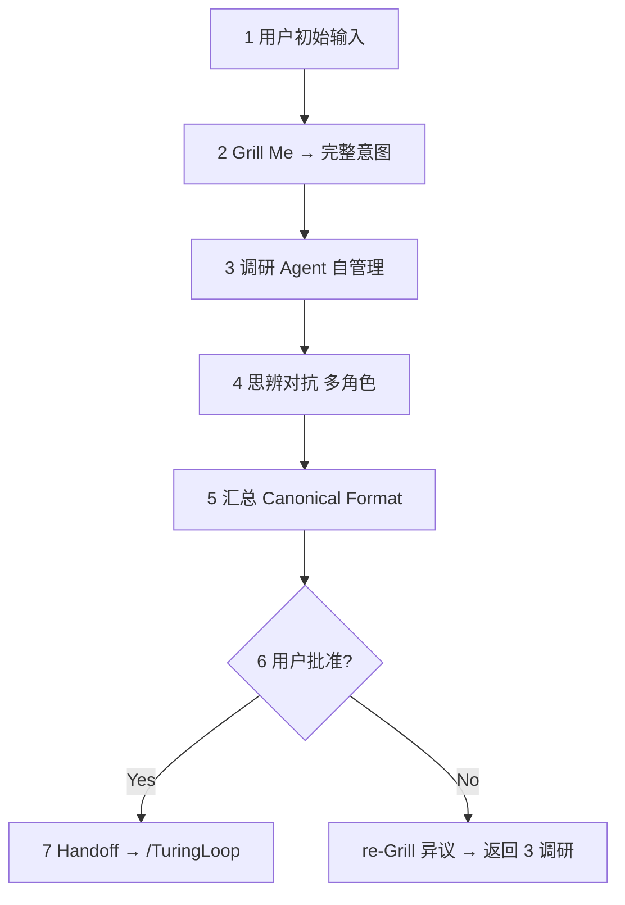

# PlanLoop — Canonical Specification v1.2

**Planning subsystem** for TuringOS Lite: structured, eval-first, anti-drift.  
**Execution subsystem:** approved plan → `/TuringLoop` (AgenticForgeLoop v1.3).

> **认证（Art. 0）**  
> 基于 2026 社区 Best Practice（Grill Me、Anthropic Harness、SWE-Agent self-healing、Karpathy Software 3.0、LangGraph/Temporal long-horizon）+ 项目文档风格审查。  
> 所有环节必要且不可精简；格式锁定为 Canonical Proposal Format v1.0。

---

## Activation

```text
Activate PlanLoop v1.2 / PlanLoop
Initial intent: [您的描述]
```

**Orchestrator 收到激活后 MUST：**
1. 读取 `AGENTS.md` + `HARNESS_INDEX.md` + `references/plan-capsule-template.yaml`
2. 实例化 PlanCapsule；**禁止**跳过 Grill Me 直接进入调研
3. 产出物必须符合 `references/canonical-proposal-format.md`（强制模板）
4. 用户批准前 **禁止** 写实现代码或 dispatch `/TuringLoop`

---

## Art. 1 — Best Practice 对齐（摘要）

| PlanLoop 环节 | 社区对齐 |
|---------------|----------|
| Grill Me 小循环 | Matt Pocock /grill-me、Socratic intent extraction |
| 调研自管理 | Claude Code research delegation、multi-agent allocation |
| 思辨对抗 | Adversarial debate / red-team in agent harnesses |
| Eval + Shipgate | Eval-first、per-level gates（Lite plan、Anthropic checkpoints） |
| 批准 + re-Grill | Self-healing approval loops、rollback to clarification |

---

## Art. 2 — 对抗性审查结论（不可跳过环节）

| 反方观点 | 结论 |
|----------|------|
| "Grill Me 太慢可跳过" | **驳回** — 跳过导致 Drift，ROI 最高投资 |
| "调研/思辨可合并" | **驳回** — 需广度（调研）+ 深度（对抗）分离 |
| "格式太重" | **驳回** — 固定格式是可验证、可追溯唯一保障 |

---

## Art. 3 — 必要性证明（5 环节）

| # | 环节 | 必要性 |
|---|------|--------|
| 1 | 用户初始输入 + **Grill Me** | 第一次输入永远不完整 |
| 2 | **调研**（Agent 自管理） | 事实基础，防凭空设计 |
| 3 | **思辨对抗**（多角色） | 单视角有盲区 |
| 4 | **汇总 → Canonical Format** | 可验证、可追溯、可执行 |
| 5 | **批准 + re-Grill 迭代** | 用户真正拥有最终意图 |

---

## PlanLoop v1.2 流程



### Step 1 — 用户初始输入
- 记录 `initial_intent` 到 PlanCapsule
- 不做方案；不写代码

### Step 2 — Grill Me 小循环
- 执行 `references/grill-me-checklist.md`
- 多轮直至 `grill_me.complete: true`
- 输出：problem_statement、desired_final_state、out_of_scope、success_metrics

### Step 3 — 调研（Agent 自管理）
- Orchestrator 分配调研子任务（WebSearch/WebFetch、repo 读、Charter/architecture）
- 仅摘要 + URL 写入 `research.findings`；禁止整页 dump
- 聚焦：现有代码、Charter 约束、类似 atom 先例

### Step 4 — 思辨对抗（多角色）
- 执行 `references/adversarial-roles.md`（Advocate / Skeptic / Minimalist / 可选 Verifier）
- 可用 `Task` subagent 并行 Skeptic + Minimalist
- 产出 `consensus_approach` + `residual_risks`

### Step 5 — 汇总 Canonical Format
- **必须**使用 `references/canonical-proposal-format.md` 骨架
- §0 Overall Eval **先于** Module/Phase/Atom
- 每层 **Shipgate**；Atom 层 **Acceptance**（可运行命令）
- 建议写入 `plans/PL-YYYYMMDD-slug.md`（或用户指定路径）

### Step 6 — 用户批准
- 呈现完整提案；**Approval Status: Pending**
- 用户回复：
  - **Yes** → `approval_status: approved`；更新 §0 sign-off
  - **No + 异议** → 记录 `user_objections` → Step 2 re-Grill（仅异议区）→ Step 3

### Step 7 — Handoff（批准后）
```yaml
handoff:
  approved_at: "YYYY-MM-DD"
  turing_loop_ready: true
  proposal_path: "plans/PL-..."
  next_action: |
    Activate AgenticForgeLoop v1.4 / TuringLoop
    Task: [from §0]
    ETA estimate: [from plan]
    frontier_mode: auto
    # atoms → allowed_files + acceptance_commands from proposal
```

更新 `HARNESS_INDEX.md` 若新增 plan 类型或路径约定 → `index_updated: true`。

---

## 与 TuringLoop 的关系

| Phase | Skill | 产出 |
|-------|-------|------|
| **Plan** | `/PlanLoop` | Canonical Proposal（Pending → Approved） |
| **Execute** | `/TuringLoop` | Code + tests + SHIP + HANDOFF |

**Rule:** PlanLoop 不写 Macro 代码。TuringLoop 不重新定义 §0 — 若执行中偏离，回到 PlanLoop re-Grill。

---

## Orchestrator 启动清单

- [ ] PlanCapsule 已实例化
- [ ] Grill Me 未跳过
- [ ] §0 Overall Eval 将在 Module 之前撰写
- [ ] Canonical Format 模板已加载
- [ ] 用户批准前零实现代码
- [ ] 进入 Step 1

---

## 参考文件

| 文件 | 用途 |
|------|------|
| `references/plan-capsule-template.yaml` | PlanCapsule v1.2 |
| `references/canonical-proposal-format.md` | **强制**输出模板 |
| `references/grill-me-checklist.md` | Step 2 Socratic 澄清 |
| `references/adversarial-roles.md` | Step 4 多角色对抗 |
| `AGENTS.md` | Charter 不变量 |
| `HARNESS_INDEX.md` | Agent 入口 |
| `TURINGOS_LITE_v1.0_PROJECT_CHARTER.md` | Atom/phase 结构参考 |

---

## 示例激活

```text
Activate PlanLoop v1.2 / PlanLoop
Initial intent: Add real LLM multi-step tool loop to API worker so TUI agent tasks can modify code with whitebox receipts
```

Orchestrator 应答：PlanCapsule ID、Grill Me 首轮问题（5–8 条）、**不**产出方案直至 Grill Me 完成。