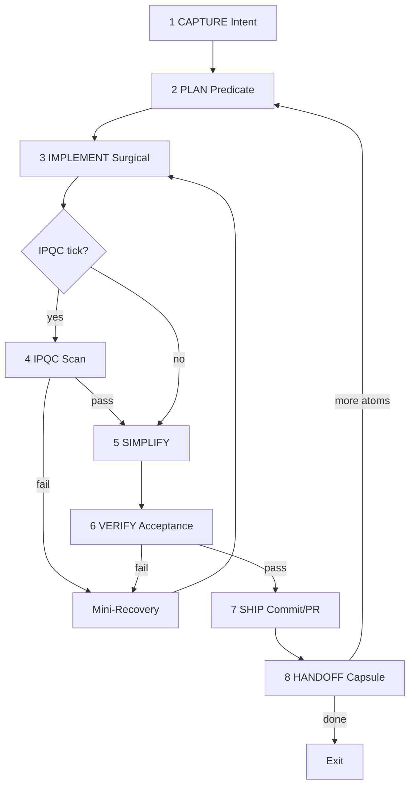

# TuringLoop — AgenticForgeLoop v1.2 for TuringOS Lite

TuringOS 专用 loop harness：融合 AgenticForgeLoop v1.2、Charter/AGENTS.md 不变量、以及 TUI Redesign 实战教训。

## Activation（用户复制即可）

```text
Activate AgenticForgeLoop v1.2 / TuringLoop
Task: [任务描述]
ETA estimate: [e.g. 2 hours / 300 steps]   # 必填
ipqc_mode: auto
Start at autonomy tier 3
```

**Orchestrator 收到激活后 MUST：**
1. 读取 `AGENTS.md` + `references/task-capsule-template.yaml`，实例化 TaskCapsule
2. 声明 5 角色分工与 acceptance_commands（先写 predicate，再写代码）
3. 进入 8 步主循环，按公式调度 IPQC

---

## 核心原则（不变）

| 原则 | 来源 | TuringOS 含义 |
|------|------|----------------|
| **Simplicity first** | Karpathy | 能 50 行不写 200；Code Simplifier 强制 |
| **Verification eats generation** | Cherny | 测试/旅程先于实现；绿测试 ≠ 绿 UX |
| **Self-healing + rule accumulation** | ForgeLoop | Mini-Recovery → 永久 rule 写入 capsule |
| **Human = architect only** | ForgeLoop | 长程默认 0 HITL；仅 escalation 才 ping |

---

## 5 角色（Orchestrator 编排）

| 角色 | 职责 | 禁止 |
|------|------|------|
| **Orchestrator** | 持 TaskCapsule、调度 IPQC/Mini、合并 handoff | 直接大块写码 |
| **Planner** | ETA、allowed/forbidden files、acceptance、IPQC 间隔 | 跳过 predicate |
| **Implementer** | 手术式改代码，匹配 repo 风格 | 越权文件、drive-by refactor |
| **Code Simplifier** | IPQC/Mini 后删减冗余、统一路径 | 改行为 |
| **Verifier + Ship Witness** | 跑 acceptance、human matrix、PR、worktree 清理 | 与 Implementer 同人（应用 subagent） |

**TuringOS 硬规则：**
- TUI 改动 → Verifier **必须**跑 `./scripts/run_human_tui_audit.sh`（strict Pilot，禁止 bypass）
- 写 Macro 代码 → 仅 Worker 白盒 + Micro receipts；Facilitator 只提案
- 并行独立 atom → `git worktree add .turingos/worktrees/<name>`

---

## Autonomy Tiers（与 TUI 对齐）

| Tier | 行为 |
|------|------|
| 0 | 每步人工确认 |
| 1 | 自动跑 unit tests |
| 2 | 自动 commit 草案，人工 approve propose |
| **3（默认）** | Agent 胶囊 `auto_execute` + Autonomy≥50% 自动 dispatch Worker；普通 propose 需人工或 tier 4 |
| 4 | 全部 propose 自动 approve（仅 mock/CI） |

长程任务从 **tier 3** 启动；`high_risk: true` 降级到 tier 1。

---

## 8 步主循环（IPQC 嵌入）



### Step 1 — CAPTURE
- 实例化 TaskCapsule（见 `references/task-capsule-template.yaml`）
- 解析 ETA → `eta_steps`（如 "2h/300 steps" → 300）
- 判定 `human_ux_gate: true` 若触及 `turingos/tui/**`

### Step 2 — PLAN（Planner）
- 写 **acceptance_commands**（必须先于代码）
- 写 allowed/forbidden files
- 计算 IPQC 间隔：
  ```bash
  .grok/skills/turing-loop/scripts/calc-ipqc-interval.sh <eta_steps> <failure_rate>
  ```
  公式：`interval = max(3, round(ETA * 0.12 / (1 + failure_rate)))`
- Think Before：列 assumptions + tradeoffs（AGENTS.md）

### Step 3 — IMPLEMENT（Implementer）
- 只改 allowed files；每步可运行部分 acceptance
- 禁止：`_facilitator_run` / `post_message` 绕过 TUI 测试（见 `tests/tui_e2e/HUMAN_SIMULATOR.md`）

### Step 4 — IPQC（动态触发）
每 `interval` 个 implement/verify 步执行 `references/ipqc-checklist.md` 四维扫描：
1. **Consistency** — scope、scale 命名
2. **Simplicity** — Simplifier 候选
3. **Test coverage** — kernel vs human 两层
4. **Regression risk** — FC-A01–A10

输出 YAML：`ipqc_pass`, `issues`, `simplifier_required`, `mini_recovery_triggered`

### Step 5 — SIMPLIFY（Code Simplifier）
- IPQC 或 Mini-Recovery 后 **强制**一轮
- 删冗余、合并路径；**不改变** acceptance 语义

### Step 6 — VERIFY（Verifier subagent，独立）
```bash
./run_test.sh
# if human_ux_gate:
./scripts/run_human_tui_audit.sh
# optional:
python -m turingos.cli audit all
```
- Implementer ≠ Verifier（用 `Task` subagent 或 `/check-work`）
- 失败 → `failure_rate += 1` → Mini-Recovery

### Step 7 — SHIP（Ship Witness）
- `git worktree` 上开发 → push → `gh pr create` → merge to **master**
- 合并后 **必须** cleanup：
  ```bash
  git worktree remove .turingos/worktrees/<name> --force
  git branch -d <branch>
  git push origin --delete <branch>
  git pull origin master
  ```

### Step 8 — HANDOFF
更新 TaskCapsule：
```yaml
handoff:
  branch: master
  commit_sha: <sha>
  pr_url: <url>
  autonomy_score: <0-100>
  failure_rate: <float>
  rules_learned: [<permanent rules from mini loops>]
  open_risks: []
  index_updated: <true if HARNESS_INDEX.md + .grok/skills/README.md synced>
next_recommended_atom: <id or "done">
```

若新增/改了 skill、脚本或 test gate → **必须**更新 `HARNESS_INDEX.md`（及 `.grok/skills/README.md`），并将 `last_verified` 设为当前 commit。

---

## Mini-Recovery Loop（4 步，全自动，非阻塞主循环）

**触发：** IPQC fail / VERIFY fail / 连续测试红

1. **Root-Cause** — 3-why + trace（journal if human sim fail）
2. **Targeted Fix** + mandatory **Simplifier pass**
3. **Burst Verification** — 全 acceptance + smoke
4. **Merge rule** — 提取永久规则写入 `rules_learned`；`failure_rate` 更新；**无缝 resume** 主循环（保留 TaskCapsule 上下文）

**Escalation（仅此处 ping human）：**
- 连续 **2** 次 Mini-Recovery 仍失败
- 用户标记 `high_risk: true`
- Charter 不变量可能被破坏（双 tape 混合、TUI 写 truth）

---

## HITL 策略（极致最小化）

| 场景 | 人工 |
|------|------|
| 正常长程 atom/phase | **0 次** |
| IPQC + Mini 自愈 | **0 次** |
| 2× Mini 失败 | **1 次** architect 决策 |
| high_risk 任务 | 启动前 **1 次** 确认 |

---

## TuringOS 专属教训（写入规则库）

从 TUI Redesign retro 固化，IPQC 应检查：

1. **两层测试** — unit 绿 ≠ UX 绿；human matrix 是 TUI 唯一 UX 门禁
2. **禁止 bypass** — `post_message(ChoiceSelected)`、`inp.value =`、直接 `_facilitator_run` 不算人类测试
3. **布局与点击** — action-row 与 MCQ 重叠会导致 silent mis-click；80×24 需 compact 模式
4. **Wizard vs Agent** — paste/NL 走 `auto_setup_turn` / `try_agent_turn`；wizard 是后备
5. **字段语义** — Bearer token 不得进 base_url；保存后要有连通性 +「回项目」叙事
6. **Autonomy 闸门** — 仅 `auto_execute` 胶囊在 tier3 自动执行；避免误 auto-approve 普通 propose
7. **Handoff** — 合并后删 worktree/remote branch；仓库默认分支是 **master** 不是 main

---

## Orchestrator 启动清单

激活后按序执行（打印给用户）：

- [ ] TaskCapsule 已填（含 ETA）
- [ ] worktree 已创建（若并行）
- [ ] acceptance_commands 已写且可运行
- [ ] IPQC interval 已计算
- [ ] 5 角色已分配（Verifier 独立）
- [ ] autonomy tier = 3
- [ ] 进入 Step 1 CAPTURE

---

## 参考文件

| 文件 | 用途 |
|------|------|
| `references/task-capsule-template.yaml` | TaskCapsule 标准模板 |
| `references/ipqc-checklist.md` | IPQC 四维扫描 |
| `scripts/calc-ipqc-interval.sh` | IPQC 间隔计算 |
| `AGENTS.md` | Charter 不变量 |
| `tests/tui_e2e/HUMAN_SIMULATOR.md` | Human UX 门禁 |
| `TURINGOS_LITE_v1.0_PROJECT_CHARTER.md` | 完整架构 |

---

## 示例激活（TUI 后续迭代）

```text
Activate AgenticForgeLoop v1.2 / TuringLoop
Task: Add real LLM multi-step tool loop to API worker for TUI agent code tasks
ETA estimate: 4 hours / 500 steps
ipqc_mode: auto
Start at autonomy tier 3
human_ux_gate: true
allowed_files: turingos/workers/api_tool_loop.py, turingos/tools/whitebox.py, tests/**
```

Orchestrator 应答：TaskCapsule ID、IPQC interval（初始）、首个 acceptance predicate，然后进入循环。