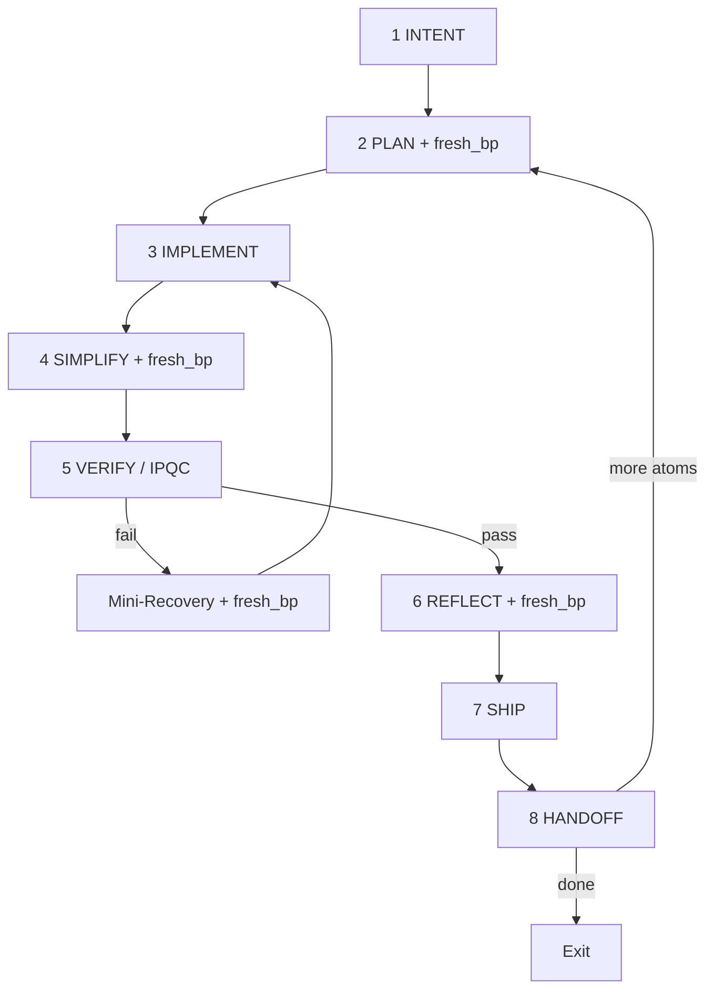

# TuringLoop — AgenticForgeLoop v1.3 for TuringOS Lite

TuringOS 专用 loop harness：融合 AgenticForgeLoop v1.3、Charter/AGENTS.md 不变量、Karpathy 极简主义审计、以及 TUI Redesign 实战教训。

**v1.3 新增：** BestPractice Alignment Pass（`fresh_bp`）— 轻量可插拔子工具，嵌入高杠杆节点，非独立步骤。

## Activation（用户复制即可）

```text
Activate AgenticForgeLoop v1.3 / TuringLoop
Task: [任务描述]
ETA estimate: [e.g. 3h / 450 steps]   # 必填
frontier_mode: auto   # auto | force | off
Start at autonomy tier 3
```

**Orchestrator 收到激活后 MUST：**
1. 读取 `AGENTS.md` + `HARNESS_INDEX.md` + `references/task-capsule-template.yaml`，实例化 TaskCapsule
2. 声明 5 角色分工与 acceptance_commands（先写 predicate，再写代码）
3. Step 2 PLAN 执行 mandatory `fresh_bp`（baseline alignment）
4. 进入 8 步主循环；IPQC 按公式调度；alignment 仅在高杠杆点触发

---

## Karpathy 理念审计（v1.3 认证）

**核心：** Keep loops small, verification fast, simplicity supreme, collapse what you can, manage agents with short leashes, build for emergence without bloat.

| 步骤 | 必要性 | Alignment 默认 |
|------|--------|----------------|
| 1 INTENT | 人类唯一锚点（objective function） | 可选 |
| **2 PLAN** | 所有后续的 scaffolding | **必须** |
| 3 IMPLEMENT | 纯执行（action phase） | 否 |
| **4 SIMPLIFY** | 复杂度 gradient descent | **必须** |
| **5 VERIFY/IPQC** | Verification eats generation | issue 时**必须** |
| Mini-Recovery | Self-healing robustness | RCA 时**必须** |
| **6 REFLECT** | Meta-learning & rule permanence | **必须** |
| 7 SHIP | Closure & irreversibility | 否 |
| 8 HANDOFF | Replayability & evolution | 可选 |

**结论：** 8 步核心不变；`fresh_bp` / `force_alignment(topic)` 为子工具，零臃肿。详见 `references/best-practice-alignment.md`。

---

## 核心原则（不变）

| 原则 | 来源 | TuringOS 含义 |
|------|------|----------------|
| **Simplicity first** | Karpathy | 能 50 行不写 200；Simplifier 强制 |
| **Verification eats generation** | Cherny | 测试/旅程先于实现；绿测试 ≠ 绿 UX |
| **Self-healing + rule accumulation** | ForgeLoop | Mini-Recovery + Reflect → 永久 rule |
| **Human = architect only** | ForgeLoop | 长程默认 0 HITL；仅 escalation 才 ping |
| **Truth-seeking freshness** | v1.3 | 关键决策点 `fresh_bp`；输出极简，不污染上下文 |

---

## BestPractice Alignment Pass（子工具，非节点）

```text
fresh_bp(topic, context)      # 搜索最新实践 → 3-bullet + delta + apply + rule_candidate
force_alignment(topic)        # 任意位置显式调用
```

- **工具：** WebSearch / WebFetch → summarize → apply decision（见 `references/best-practice-alignment.md`）
- **`frontier_mode`：** `auto`（默认）| `force` | `off`
- **输出：** 始终 append 极简 YAML 到 `alignment_passes[]`；禁止整页粘贴进 capsule

---

## 5 角色（Orchestrator 编排）

| 角色 | 职责 | 禁止 |
|------|------|------|
| **Orchestrator** | 持 TaskCapsule、调度 alignment/IPQC/Mini/Reflect、合并 handoff | 直接大块写码 |
| **Planner** | ETA、scope、acceptance、IPQC 间隔、Step 2 `fresh_bp` | 跳过 predicate |
| **Implementer** | 手术式改代码，匹配 repo 风格 | 越权文件、drive-by refactor |
| **Code Simplifier** | Step 4 删减冗余 + mandatory `fresh_bp` | 改行为 |
| **Verifier + Ship Witness** | Step 5 acceptance、human matrix、PR、worktree 清理 | 与 Implementer 同人 |

**TuringOS 硬规则：**
- TUI 改动 → Verifier **必须**跑 `./scripts/run_human_tui_audit.sh`（strict Pilot，禁止 bypass）
- 写 Macro 代码 → 仅 Worker 白盒 + Micro receipts；Facilitator 只提案
- 并行独立 atom → `git worktree add .turingos/worktrees/<name>`

---

## Autonomy Tiers（与 TUI 对齐）

| Tier | 行为 |
|------|------|
| 0 | 每步人工确认 |
| 1 | 自动跑 unit tests |
| 2 | 自动 commit 草案，人工 approve propose |
| **3（默认）** | Agent 胶囊 `auto_execute` + Autonomy≥50% 自动 dispatch Worker |
| 4 | 全部 propose 自动 approve（仅 mock/CI） |

长程任务从 **tier 3** 启动；`high_risk: true` 降级到 tier 1。

---

## 8 步核心循环（v1.3）



### Step 1 — INTENT
- 实例化 TaskCapsule v1.3（`frontier_mode`, `alignment_topics`）
- 解析 ETA → `eta_steps`
- 判定 `human_ux_gate: true` 若触及 `turingos/tui/**`
- 可选：`fresh_bp` 初始 topic 扫描（`frontier_mode: force` 时）

### Step 2 — PLAN（Planner + mandatory alignment）
- 写 **acceptance_commands**（必须先于代码）
- 写 allowed/forbidden files
- **`fresh_bp`** — baseline best practices（mandatory unless `frontier_mode: off`）
- 计算 IPQC 间隔：
  ```bash
  .grok/skills/turing-loop/scripts/calc-ipqc-interval.sh <eta_steps> <failure_rate>
  ```
- Think Before：assumptions + tradeoffs（AGENTS.md）

### Step 3 — IMPLEMENT（Implementer）
- 只改 allowed files；每步可运行部分 acceptance
- 禁止：`_facilitator_run` / `post_message` 绕过 TUI 测试（`tests/tui_e2e/HUMAN_SIMULATOR.md`）
- 无默认 alignment（保持执行专注）

### Step 4 — SIMPLIFY（Code Simplifier + mandatory alignment）
- 删冗余、合并路径；**不改变** acceptance 语义
- **`fresh_bp`** — fresh elegance patterns（mandatory unless off）
- Mini-Recovery 后也在进入 Step 4 前强制 Simplifier pass

### Step 5 — VERIFY / IPQC（Verifier 独立）
```bash
./run_test.sh
# if human_ux_gate:
./scripts/run_human_tui_audit.sh
# optional:
python -m turingos.cli audit all
```
- 动态 IPQC：`references/ipqc-checklist.md` 四维扫描
- **IPQC issue → `fresh_bp`**（quality alignment）
- Implementer ≠ Verifier（`Task` subagent 或 `/check-work`，二选一）
- 失败 → `failure_rate += 1` → Mini-Recovery

### Step 6 — REFLECT（mandatory alignment on rules）
- 从本 atom 提取永久规则 → `rules_learned`
- **`fresh_bp`** — 对照社区/SOTA 升级 rule 候选（mandatory unless off）
- 合并 alignment `rule_candidate` → 去重后写入 `rules_learned`
- 更新 `failure_rate`、autonomy 估计

### Step 7 — SHIP（Ship Witness）
- worktree → push → `gh pr create` → merge to **master**
- 合并后 cleanup：
  ```bash
  git worktree remove .turingos/worktrees/<name> --force
  git branch -d <branch>
  git push origin --delete <branch>
  git pull origin master
  ```

### Step 8 — HANDOFF
```yaml
handoff:
  branch: master
  commit_sha: <sha>
  pr_url: <url>
  freshness_delta: "<e.g. 3 new SOTA practices applied>"
  new_rules_added: <int>
  autonomy_achieved: <0-100%>
  failure_rate: <float>
  rules_learned: [<permanent rules>]
  open_risks: []
  index_updated: <true if HARNESS_INDEX.md synced>
next_recommended_atom: <id or "done">
```

新增/改 skill、脚本或 test gate → 更新 `HARNESS_INDEX.md` + `.grok/skills/README.md`。

---

## Mini-Recovery Loop（4 步 + alignment）

**触发：** IPQC fail / VERIFY fail / 连续测试红

1. **Root-Cause** — 3-why + trace + **`fresh_bp`**（fresh remedies）
2. **Targeted Fix** + mandatory Simplifier pass
3. **Burst Verification** — 全 acceptance
4. **Merge rule** — 写入 `rules_learned`；resume 主循环

**Escalation（仅此处 ping human）：**
- 连续 **2** 次 Mini-Recovery 仍失败
- `high_risk: true`
- Charter 不变量可能被破坏

---

## HITL 策略

| 场景 | 人工 |
|------|------|
| 正常长程 atom/phase | **0 次** |
| Alignment + IPQC + Mini 自愈 | **0 次** |
| 2× Mini 失败 | **1 次** architect 决策 |
| high_risk 任务 | 启动前 **1 次** 确认 |

---

## TuringOS 专属教训（Reflect / IPQC 检查）

1. **两层测试** — unit 绿 ≠ UX 绿；human matrix 是 TUI 唯一 UX 门禁
2. **禁止 bypass** — `post_message(ChoiceSelected)`、`inp.value =`、`_facilitator_run`
3. **布局与点击** — action-row 与 MCQ 重叠 → silent mis-click；80×24 compact
4. **Wizard vs Agent** — paste/NL → `auto_setup_turn` / `try_agent_turn`
5. **字段语义** — Bearer 不进 base_url；保存后连通性 +「回项目」
6. **Autonomy 闸门** — 仅 `auto_execute` 胶囊 tier3 自动执行
7. **Handoff** — 合并后删 worktree/remote branch；默认分支 **master**

---

## Orchestrator 启动清单

- [ ] TaskCapsule v1.3 已填（ETA + `frontier_mode`）
- [ ] worktree 已创建（若并行）
- [ ] acceptance_commands 已写且可运行
- [ ] IPQC interval 已计算
- [ ] Step 2 `fresh_bp` 已执行（unless off）
- [ ] 5 角色已分配（Verifier 独立）
- [ ] autonomy tier = 3
- [ ] 进入 Step 1 INTENT

---

## 参考文件

| 文件 | 用途 |
|------|------|
| `references/task-capsule-template.yaml` | TaskCapsule v1.3 |
| `references/best-practice-alignment.md` | `fresh_bp` / `frontier_mode` |
| `references/ipqc-checklist.md` | IPQC 四维扫描 |
| `scripts/calc-ipqc-interval.sh` | IPQC 间隔 |
| `HARNESS_INDEX.md` | Agent 入口 catalog |
| `AGENTS.md` | Charter 不变量 |
| `tests/tui_e2e/HUMAN_SIMULATOR.md` | Human UX 门禁 |

---

## 示例激活

```text
Activate AgenticForgeLoop v1.3 / TuringLoop
Task: Add real LLM multi-step tool loop to API worker for TUI agent code tasks
ETA estimate: 4 hours / 500 steps
frontier_mode: auto
alignment_topics: ["llm_tool_loop", "agentic_loop"]
Start at autonomy tier 3
human_ux_gate: true
allowed_files: turingos/workers/api_tool_loop.py, turingos/tools/whitebox.py, tests/**
```

Orchestrator 应答：TaskCapsule ID、IPQC interval、Step 2 alignment topic、首个 acceptance predicate，然后进入循环。