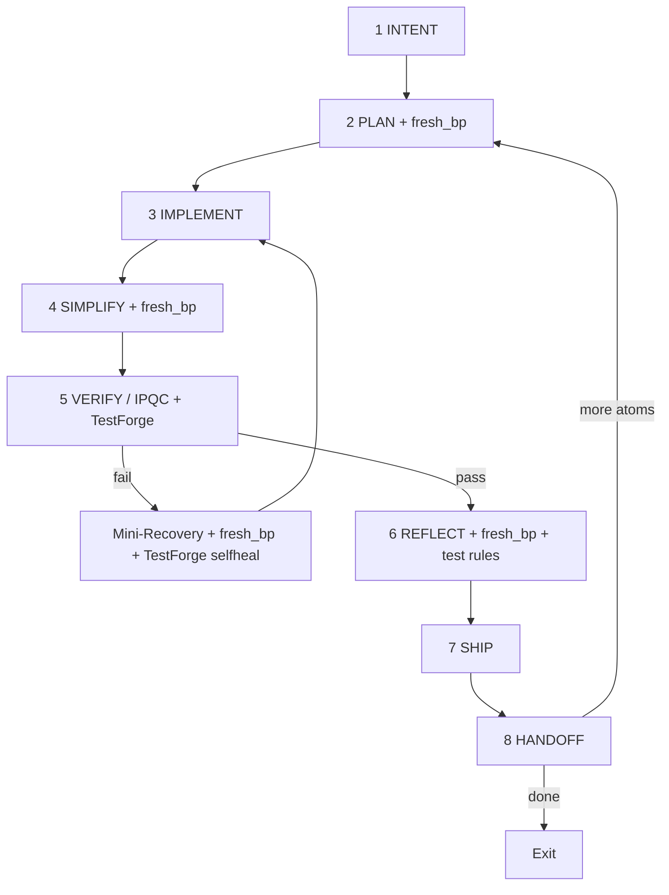

# TuringLoop — AgenticForgeLoop v1.4 for TuringOS Lite

TuringOS 专用 loop harness：融合 AgenticForgeLoop v1.4、Charter/AGENTS.md 不变量、Karpathy 极简主义审计、以及 TUI Redesign 实战教训。

**v1.4 新增：** TestForge — 验证增强子工具，嵌入 VERIFY/IPQC、Mini-Recovery、REFLECT；**非**独立 Loop。  
**v1.3 保留：** BestPractice Alignment Pass（`fresh_bp`）— 轻量可插拔，非独立步骤。

## Activation（用户复制即可）

```text
Activate AgenticForgeLoop v1.4 / TuringLoop
Task: [任务描述]
ETA estimate: [e.g. 4h / 600 steps]   # 必填
frontier_mode: auto   # auto | force | off
test_mode: auto_full  # auto_full | ipqc_only | manual_review
Start at autonomy tier 3
```

**Orchestrator 收到激活后 MUST：**
1. 读取 `AGENTS.md` + `HARNESS_INDEX.md` + `references/task-capsule-template.yaml`，实例化 TaskCapsule v1.4
2. 声明 5 角色分工与 acceptance_commands（先写 predicate，再写代码）
3. Step 2 PLAN 执行 mandatory `fresh_bp`（baseline alignment）
4. 进入 8 步主循环；TestForge + alignment 仅在高杠杆点触发；**8 步节点数不变**

---

## Karpathy 理念审计（v1.4 认证）

**核心：** Keep loops small, verification fast, simplicity supreme, collapse what you can, manage agents with short leashes, build for emergence without bloat.

| 步骤 | 必要性 | Alignment | TestForge |
|------|--------|-----------|-----------|
| 1 INTENT | 人类锚点 | 可选 | — |
| **2 PLAN** | Scaffolding | **必须** | — |
| 3 IMPLEMENT | Action | 否 | — |
| **4 SIMPLIFY** | Elegance | **必须** | — |
| **5 VERIFY/IPQC** | Verification eats generation | issue 时**必须** | **核心嵌入** |
| Mini-Recovery | Self-healing | RCA 时**必须** | **selfheal 强化** |
| **6 REFLECT** | Meta-learning | **必须** | **规则提取** |
| 7 SHIP | Closure | 否 | — |
| 8 HANDOFF | Replay | 可选 | 证据汇总 |

**结论：** 8 步核心不变；`fresh_bp` 与 `TestForge` 均为子工具，零臃肿。详见 `references/best-practice-alignment.md`、`references/test-forge.md`。

---

## 核心原则（不变）

| 原则 | 来源 | TuringOS 含义 |
|------|------|----------------|
| **Simplicity first** | Karpathy | 能 50 行不写 200；Simplifier 强制 |
| **Verification eats generation** | Cherny | TestForge 嵌入 VERIFY；绿 unit ≠ 绿 UX |
| **Self-healing + rule accumulation** | ForgeLoop | Mini-Recovery + Reflect → 永久 rule |
| **Human = architect only** | ForgeLoop | 长程默认 0 HITL；仅 escalation 才 ping |
| **Truth-seeking freshness** | v1.3 | 关键决策点 `fresh_bp` |
| **Embedded testing** | v1.4 | TestForge 非独立 Loop；receipts + shipgate 自动记录 |

---

## TestForge（子工具，非节点）

```text
TestForge(mode=standard|ipqc|selfheal, scope=atom|phase|module)
```

- **嵌入：** Step 5 VERIFY/IPQC（常规 + IPQC 测试）、Mini-Recovery（selfheal）、Step 6 REFLECT（测试规则提取）
- **`test_mode`：** `auto_full`（默认）| `ipqc_only` | `manual_review`
- **输出：** pass/fail + delta + shipgate evidence → `test_forge_passes[]`（见 `references/test-forge.md`）
- **失败：** 自动触发 Mini-Recovery；禁止 SHIP

**TuringOS 命令映射：**
- `standard` → `./run_test.sh` (+ `./scripts/run_human_tui_audit.sh` if `human_ux_gate`)
- `ipqc` → targeted pytest on changed paths + IPQC §3
- `selfheal` → full acceptance burst + failed journey re-run

---

## BestPractice Alignment Pass（子工具，非节点）

```text
fresh_bp(topic, context)
force_alignment(topic)
```

见 `references/best-practice-alignment.md`。`frontier_mode: auto | force | off`。

---

## 5 角色（Orchestrator 编排）

| 角色 | 职责 | 禁止 |
|------|------|------|
| **Orchestrator** | 持 TaskCapsule、调度 TestForge/alignment/IPQC/Mini/Reflect | 直接大块写码 |
| **Planner** | ETA、scope、acceptance、IPQC 间隔、Step 2 `fresh_bp` | 跳过 predicate |
| **Implementer** | 手术式改代码，匹配 repo 风格 | 越权文件、drive-by refactor |
| **Code Simplifier** | Step 4 删减冗余 + mandatory `fresh_bp` | 改行为 |
| **Verifier + Ship Witness** | Step 5 **TestForge** + IPQC、human matrix、PR、cleanup | 与 Implementer 同人 |

**TuringOS 硬规则：**
- TUI 改动 → TestForge `standard` **必须**含 human journey matrix（strict Pilot，禁止 bypass）
- 写 Macro 代码 → 仅 Worker 白盒 + Micro receipts；Facilitator 只提案
- 并行独立 atom → `git worktree add .turingos/worktrees/<name>`

---

## Autonomy Tiers（与 TUI 对齐）

| Tier | 行为 |
|------|------|
| 0 | 每步人工确认 |
| 1 | 自动跑 unit tests |
| 2 | 自动 commit 草案，人工 approve propose |
| **3（默认）** | Agent 胶囊 `auto_execute` + Autonomy≥50% 自动 dispatch Worker |
| 4 | 全部 propose 自动 approve（仅 mock/CI） |

长程任务从 **tier 3** 启动；`high_risk: true` 降级到 tier 1。

---

## 8 步核心循环（v1.4）



### Step 1 — INTENT
- 实例化 TaskCapsule v1.4（`frontier_mode`, `test_mode`, `alignment_topics`）
- 解析 ETA → `eta_steps`
- 判定 `human_ux_gate: true` 若触及 `turingos/tui/**`

### Step 2 — PLAN（Planner + mandatory alignment）
- 写 **acceptance_commands**（必须先于代码 — TestForge red-green 基础）
- 写 allowed/forbidden files
- **`fresh_bp`** — baseline（mandatory unless `frontier_mode: off`）
- 计算 IPQC 间隔：
  ```bash
  .grok/skills/turing-loop/scripts/calc-ipqc-interval.sh <eta_steps> <failure_rate>
  ```

### Step 3 — IMPLEMENT（Implementer）
- 只改 allowed files；可跑部分 acceptance
- 禁止 bypass TUI 测试（`tests/tui_e2e/HUMAN_SIMULATOR.md`）
- IPQC tick 时 Orchestrator 可调度 `TestForge(mode=ipqc)`（`test_mode: auto_full`）

### Step 4 — SIMPLIFY（Code Simplifier + mandatory alignment）
- 删冗余；**不改变** acceptance 语义
- **`fresh_bp`** — elegance patterns（mandatory unless off）

### Step 5 — VERIFY / IPQC（Verifier 独立 + TestForge 核心）
- **`TestForge(mode=standard, scope=atom|phase|module)`** — 主验证门禁
- 动态 IPQC + **`TestForge(mode=ipqc)`** at interval ticks
- IPQC issue → **`fresh_bp`**
- Implementer ≠ Verifier（`Task` subagent 或 `/check-work`，二选一）
- 失败 → `failure_rate += 1` → Mini-Recovery

### Step 6 — REFLECT（alignment + TestForge 规则提取）
- 从 `test_forge_passes[]` 提取测试最佳实践 → `rules_learned`
- **`fresh_bp`** — SOTA rule 升级（mandatory unless off）
- 更新 autonomy 估计

### Step 7 — SHIP（Ship Witness）
- 要求最近 TestForge `standard` pass + shipgate evidence
- worktree → PR → merge **master** → cleanup worktree/remote branch

### Step 8 — HANDOFF
```yaml
handoff:
  branch: master
  commit_sha: <sha>
  pr_url: <url>
  freshness_delta: "<e.g. 3 new SOTA practices applied>"
  test_summary: "<e.g. IPQC + 24 journeys PASS | 3 new test rules extracted>"
  new_rules_added: <int>
  autonomy_achieved: <0-100%>
  failure_rate: <float>
  rules_learned: []
  open_risks: []
  index_updated: <true if HARNESS_INDEX.md synced>
next_recommended_atom: <id or "done">
```

---

## Mini-Recovery Loop（4 步 + alignment + TestForge selfheal）

**触发：** TestForge fail / IPQC fail / VERIFY fail

1. **Root-Cause** — 3-why + trace + **`fresh_bp`**
2. **Targeted Fix** + mandatory Simplifier pass
3. **Burst Verification** — **`TestForge(mode=selfheal, scope=module)`**
4. **Merge rule** — 测试 + RCA 规则 → `rules_learned`；resume 主循环

**Escalation：** 2× Mini 失败 | `high_risk` | Charter 不变量风险

---

## HITL 策略

| 场景 | 人工 |
|------|------|
| 正常长程 atom/phase | **0 次** |
| TestForge + Alignment + Mini 自愈 | **0 次** |
| `test_mode: manual_review` | SHIP 前 **1 次** |
| 2× Mini 失败 | **1 次** architect 决策 |

---

## TuringOS 专属教训（Reflect / IPQC / TestForge）

1. **两层测试** — unit 绿 ≠ UX 绿；human matrix 是 TUI UX shipgate
2. **禁止 bypass** — `post_message`、`inp.value =`、`_facilitator_run`
3. **TestForge 记录 shipgate** — command + exit + hash；HANDOFF 含 `test_summary`
4. **Autonomy 闸门** — 仅 `auto_execute` 胶囊 tier3 自动执行
5. **Handoff** — 合并后删 worktree；默认分支 **master**

---

## Orchestrator 启动清单

- [ ] TaskCapsule v1.4（ETA + `frontier_mode` + `test_mode`)
- [ ] acceptance_commands 先于代码
- [ ] IPQC interval 已计算
- [ ] Step 2 `fresh_bp` 已执行（unless off）
- [ ] Verifier 独立；TestForge 映射已确认
- [ ] autonomy tier = 3
- [ ] 进入 Step 1 INTENT

---

## 参考文件

| 文件 | 用途 |
|------|------|
| `references/task-capsule-template.yaml` | TaskCapsule v1.4 |
| `references/test-forge.md` | **TestForge** modes + shipgate |
| `references/best-practice-alignment.md` | `fresh_bp` / `frontier_mode` |
| `references/ipqc-checklist.md` | IPQC + TestForge tick |
| `scripts/calc-ipqc-interval.sh` | IPQC 间隔 |
| `tests/tui_e2e/HUMAN_SIMULATOR.md` | Human UX 门禁 |

---

## 示例激活

```text
Activate AgenticForgeLoop v1.4 / TuringLoop
Task: Add real LLM multi-step tool loop to API worker for TUI agent code tasks
ETA estimate: 4 hours / 600 steps
frontier_mode: auto
test_mode: auto_full
alignment_topics: ["llm_tool_loop", "agentic_loop"]
Start at autonomy tier 3
human_ux_gate: true
allowed_files: turingos/workers/api_tool_loop.py, turingos/tools/whitebox.py, tests/**
```

Orchestrator 应答：TaskCapsule ID、IPQC interval、TestForge scope、Step 2 alignment topic、首个 acceptance predicate，然后进入循环。